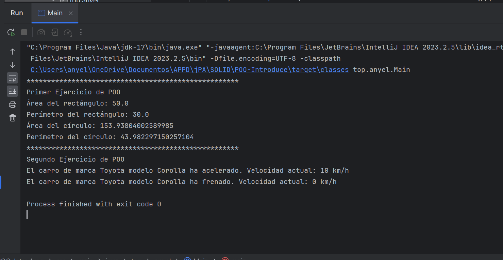

# Proyecto de Ejemplos de Programación Orientada a Objetos en Java

Este proyecto contiene ejemplos de implementaciones en Java que ilustran los conceptos de Programación Orientada a Objetos (POO), incluyendo los cuatro pilares: encapsulamiento, herencia, polimorfismo y abstracción.

## **Select Language:**
- [Español (Spanish)](README-es.md)
- [English](README.md)

## Result
### Console of result of the project


## Requisitos

- Java Development Kit (JDK) 17 o superior

## Estructura del Proyecto

El proyecto está organizado de la siguiente manera:

- **src/top/anyel**: Contiene los archivos fuente del proyecto.
  - **figuras**: Paquete que contiene las clases relacionadas con figuras geométricas.
  - **vehiculo**: Paquete que contiene las clases relacionadas con vehículos.
- **Main.java**: Clase principal que contiene el método `main` para ejecutar los ejemplos.

## Ejecución

Para ejecutar el proyecto, sigue estos pasos:

1. Clona este repositorio en tu máquina local:

```
git clone https://github.com/tu-usuario/proyecto-ejemplos-poo-java.git
```

2. Navega al directorio del proyecto:

```
cd proyecto-ejemplos-poo-java
```

3. Compila los archivos fuente:

```
javac -d out src/top/anyel/*.java src/top/anyel/figuras/*.java src/top/anyel/vehiculo/*.java
```

4. Ejecuta la clase `Main`:

```
java -cp out top.anyel.Main
```

## Contacto

Si tienes alguna pregunta o sugerencia, no dudes en contactarme: anyel@example.com
