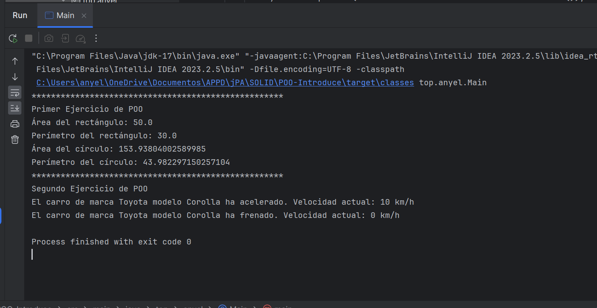

# Object-Oriented Programming Examples in Java Project

This project contains examples of Java implementations that illustrate the concepts of Object-Oriented Programming (OOP), including the four pillars: encapsulation, inheritance, polymorphism, and abstraction.

## **Select Language:**
- [Español (Spanish)](README-es.md)
- [English](README.md)

## Result
### Console of result of the project


## Requirements

- Java Development Kit (JDK) 17 or higher

## Project Structure

The project is organized as follows:

- **src/top/anyel**: Contains the source files of the project.
    - **figuras**: Package containing classes related to geometric shapes.
    - **vehiculo**: Package containing classes related to vehicles.
- **Main.java**: Main class containing the `main` method to run the examples.

## Execution

To run the project, follow these steps:

1. Clone this repository on your local machine:

```
git clone https://github.com/Anyel-ec/POO-JAVA-INTRODUCE
```

2. Navigate to the project directory:

```
cd POO-JAVA-INTRODUCE
```

3. Compile the source files:

```
javac -d out src/top/anyel/*.java src/top/anyel/figuras/*.java src/top/anyel/vehiculo/*.java
```

4. Run the `Main` class:

```
java -cp out top.anyel.Main
```

